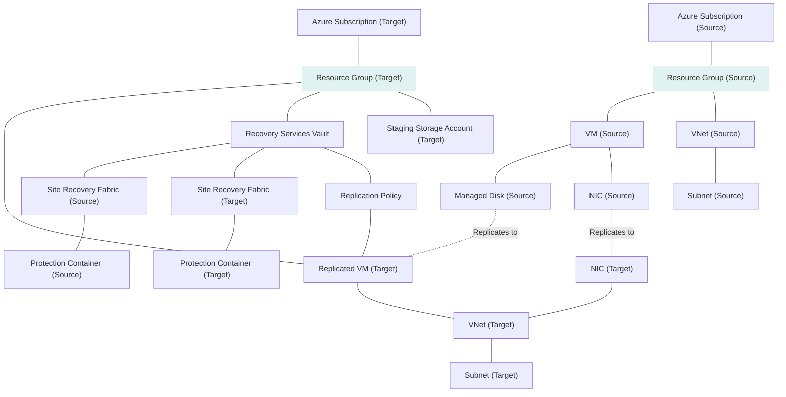

<!-- BEGIN_TF_DOCS -->

# terraform-azurerm-avm-bcdr-replication

This Terraform module is designed to set up Azure-to-Azure replication for disaster recovery. It supports replication across regions or within the same region across zones.

## Features

This module provides functionality for:

-   Creating or using an existing Recovery Services Vault.
-   Replicating virtual machines between Azure regions or between zones within the same region.
-   Handling recovery policies, replication policies, and protection container mappings.
-   Dealing with resource dependencies for orderly creation and deletion.

## Pattern Description

The module replicates virtual machines within Azure from a source to a target location, handling all intermediary replication policies, and resource configurations. Here's a chart to illustrate the replication pattern:



From the chart, the flow of replication can be seen clearly starting from the original VM in the source subscription, through various networking and storage resources, arriving at the target replicated VM in the target subscription.

## Example Usage

```
 # Example usage of the module
 module "avm_bcdr_replication" {
  source = "../../."

  source_location            = "West US"
  target_location            = "East US"
  use_existing_vault         = false
  vault_name                 = "example-vault"
  vault_resource_group_name  = "example-resource-group"

  replicated_vms = {
    "example-vm" = {
      # Virtual machine and replication configuration details
    }
  }

  enable_capacity_reservation         = false
  create_capacity_reservation_group   = false
  recovery_point_retention_in_minutes = 720
  application_consistent_snapshot_frequency_in_minutes = 240
  tags = {
    Environment = "Production"
  }
}

```

## Inputs

Below is a list of all possible input variables that users can set to customize the behavior of this module:

### Required Inputs

-   `source_location`: The source Azure region where the VMs are located.
-   `target_location`: The Azure region where replicated VMs will be located.

### Optional Inputs

-   `enable_telemetry`: Enable telemetry for the module (default to `false`).
-   `replicated_vm_name`: Name of the replicated VM.
-   `use_existing_vault`: Use an existing Recovery Services Vault (set to `true` to use an existing vault).
-   `vault_resource_group_name`: The name of the resource group where the target vault exists.
-   `vault_name`: Name of the Recovery Services Vault to be created, if not using an existing one.
-   `recovery_point_retention_in_minutes`: Duration in minutes for which the recovery points need to be stored.
-   `application_consistent_snapshot_frequency_in_minutes`: The frequency in minutes at which application-consistent snapshots are taken.
-   `tags`: A map of tags to apply to all resources.
-   `environment`: The environment for the resources (`prod`, `dev`, etc.).
-   Many other settings related to network, storage, replication, and Azure capacity reservations.

## Outputs

This module outputs various useful values, including:

-   `vault_name`: The name of the recovery services vault.
-   `site_recovery_fabric_name_source`: The name of the source site recovery fabric.
-   Replicated VM names, IDs, and other related information.
-   Capacity reservation group name and IDs if applicable.
-   Network mapping names used for replicated VMs.

## Known limitations

- High  churn is not supported because the terraform resource azurerm_site_recovery_replicated_vm doesn't support it, there is an open github issue: https://github.com/hashicorp/terraform-provider-azurerm/issues/23343

<!-- END_TF_DOCS -->
